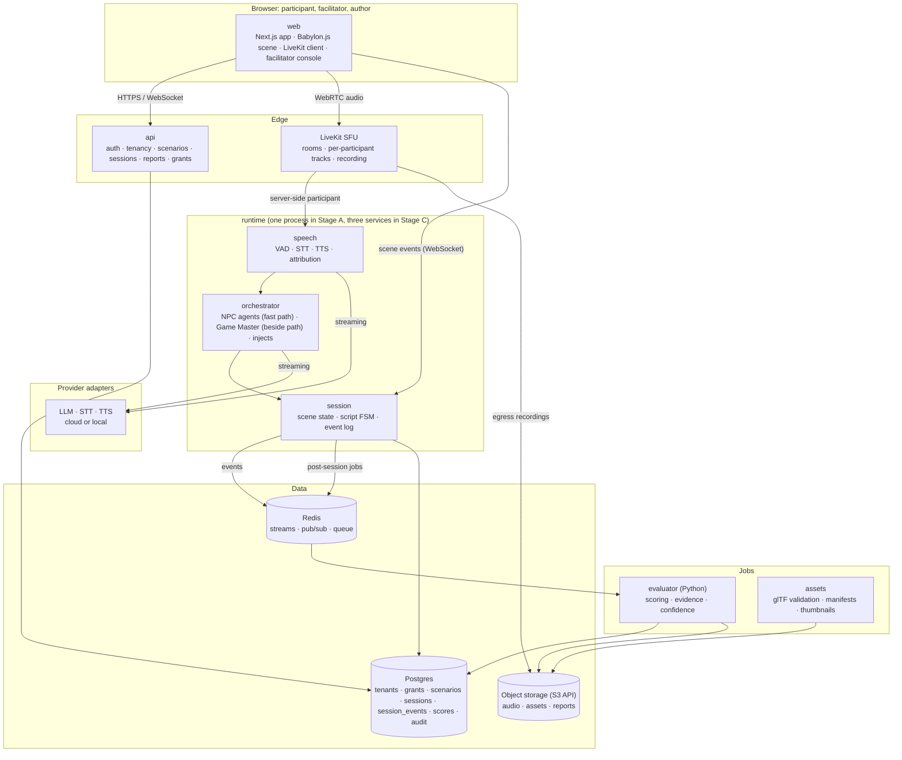

# AI Coaching RPG — Technical Architecture

Status: approved design, 1 October 2026
Companion to: *AI Coaching RPG — Product Specification* (sections referenced as "Spec §n")

## 1. Purpose and scope

This document describes the technical architecture for delivering the AI Coaching RPG: a multiplayer, script-driven role-play simulator in which a team plays scripted scenarios against AI-played counterparts inside a 3D scene, with every interaction recorded, transcribed and scored against rubrics.

It covers system structure, the real-time session path, AI orchestration, the 3D world and asset pipeline, the web application and its UI surfaces, data, security, deployment staging, observability and testing. It does not restate product requirements; where a design choice exists to satisfy a requirement, the Spec section is cited.

### Design goals, in priority order

1. **Runs on a laptop first.** The complete MVP starts with one command on a developer's or facilitator's machine, with participants joining over the LAN or a tunnel.
2. **Platform-agnostic.** The same codebase and container images deploy to Azure, AWS, GCP or any Kubernetes cluster by configuration, never by code changes.
3. **Prototype to enterprise without a rewrite.** Tenancy, audit, consent and retention are present in the schema and interfaces from day one, switched on by stage.
4. **Voice that feels conversational.** Time-to-first-audio for an NPC reply is a measured budget, not an aspiration.
5. **Script-first.** Everything the simulation does, including the 3D scene, is driven by the author-editable scenario script (Spec §6).

### Approach chosen

Containers plus ports-and-adapters. Every service is a container; cloud-specific capabilities sit behind six small adapter interfaces with one implementation per provider. Open-source infrastructure (Postgres, Redis, MinIO, LiveKit, OIDC) is the default and runs locally; managed equivalents are swapped in per cloud.

Alternatives considered and rejected: cloud-native serverless per cloud (three deployments to maintain; poor fit for the real-time session loop and asset processing), and a portability framework such as Dapr (fewer adapters to write, but another runtime to operate and abstractions that leak for streaming audio and large blobs).

## 2. System overview



### Services

| Service | Responsibility | Language | Stage A | Stage C |
| --- | --- | --- | --- | --- |
| `web` | Next.js app: authoring studio, lobby, 3D session view, facilitator console, reports | TypeScript | container | container |
| `api` | Auth, tenancy, role grants, scenario CRUD and validation, session lifecycle, reports, exports | TypeScript (Node) | container | container |
| `runtime` | Live session loop: scene state and script interpreter (`session`), VAD/STT/TTS and speaker attribution (`speech`), NPC agents and Game Master (`orchestrator`) | TypeScript (Node), LiveKit Agents | one container | three containers, same modules |
| `evaluator` | Post-session scoring against rubrics, evidence quoting, confidence rating, calibration runs | Python | container | container |
| `assets` | Level and avatar upload validation, manifest parsing, draco compression, thumbnails | TypeScript (Node) | container | container |

### Infrastructure

| Component | Role | Stage A (laptop) | Stage B (pilot) | Stage C (enterprise) |
| --- | --- | --- | --- | --- |
| Postgres | System of record | container | managed Postgres | managed Postgres, per region |
| Redis | Event streams, pub/sub, job queue | container | managed Redis | managed Redis |
| Object storage | Audio, assets, reports | MinIO container | S3 / Blob / GCS via adapter | same |
| LiveKit | WebRTC rooms, recording | container | LiveKit Cloud or self-hosted | self-hosted per region |
| Identity | OIDC provider | built-in stub | Entra ID / Okta / Keycloak | same |
| Reverse proxy | TLS, routing | Caddy container | Caddy or cloud load balancer | ingress controller |

### Communication

- `web` ↔ `api`: HTTPS (REST + server-sent events for long jobs).
- `web` ↔ `runtime`: WebSocket for scene events and facilitator commands; WebRTC via LiveKit for audio.
- `runtime` → Redis streams: every session event is appended; `api` and the facilitator console subscribe.
- `runtime` → queue: post-session jobs (finalise transcript, evaluate, generate reports).
- Everything else goes through an adapter (section 9).

## 3. Real-time session path

### Standalone session view (Stage A onward)

Each session is a LiveKit room.

1. A participant joins the room from the browser and publishes a microphone track. Their LiveKit identity is their SSO subject (or stub user id), so **speaker attribution is per track and needs no voice biometrics** (Spec REC-07 standalone fallback becomes unnecessary here).
2. `runtime` joins the room as a server-side participant and subscribes to every participant track individually.
3. Per track, a voice-activity detector segments speech; streaming STT yields partial and final transcripts; finals are appended to the session event log with speaker, scene and timestamps.
4. The NPC fast path (section 4) produces a reply; TTS streams audio which `runtime` publishes to the room as a bot track for that NPC, so it mixes naturally with human voices.
5. Scene events (spawn, move, action, camera, prop, inject artefact) are broadcast over WebSocket to every client and appended to the same event log.

LiveKit's egress records a per-track audio file to object storage for playback and re-transcription.

### Teams path (Stage B onward)

A meeting bot (Bot Framework, application-hosted media) joins the Teams meeting and exposes the same interface to `runtime` as a LiveKit room: per-participant audio in, NPC audio out, participant identity from the meeting roster. Everything from the VAD onward is identical. A Teams companion app (tab) hosts the `web` client for briefs, injects, the 3D scene and the facilitator console.

This is the one component that is inherently cloud-shaped: the bot needs a public HTTPS endpoint and an Entra app registration, so the laptop stage runs the standalone view only. Zoom follows the same pattern with the Zoom Meeting SDK.

### Session state and reconnect

Session state is **event-sourced**. The authoritative log is a Redis stream per session (`session:{id}:events`), persisted to the `session_events` table on every turn. The current scene, timers, NPC goal state and avatar positions are projections of that log held in memory by `runtime` and rebuilt from the log on restart. A reconnecting client replays events from its last acknowledged sequence number, which is what makes RUN-09 (reconnect with transcript so far) a free consequence of the design rather than a feature.

The script interpreter is a finite-state machine over scenes. Transitions fire on `time_box_elapsed` (timer), `facilitator_advance` (console command) or `gm_detects` (Game Master verdict, logged with its reasoning).

## 4. AI orchestration

### Fast path: NPC agents

One agent per NPC role, built on the LiveKit Agents framework, which provides the streaming VAD → STT → LLM → TTS chain with interruption handling.

Per turn the NPC receives:

- a **cached persona prefix**: persona, goals, knowledge, guardrails and voice style from the role file (Spec §6), identical every turn and therefore served from the provider's prompt cache;
- the current scene goal and the Game Master's latest goal and knowledge updates;
- a sliding window of the transcript visible to that role, with a running summary for long sessions.

Output tokens stream to TTS sentence by sentence; audio frames publish as they are synthesised.

### Beside the path: Game Master

The Game Master does **not** sit between the transcript and the NPC. It runs beside the fast path, triggered every N turns, on a timer tick, or by a facilitator command. It reads the script and the event log, evaluates `exit_when` conditions, schedules injects, and writes NPC goal and knowledge updates that take effect on each NPC's next turn. It uses a stronger reasoning model than the NPCs and tolerates seconds of latency because nothing waits on it.

### Latency budget (NPC reply, measured per turn)

| Stage | Target (cloud providers) | Target (local speech + local model) |
| --- | --- | --- |
| VAD end-of-utterance | 300–500 ms after last speech | same |
| STT final transcript | +150 ms | +200 ms |
| LLM first token (cached prefix) | +300–500 ms | +200–400 ms |
| TTS first audio chunk | +200–300 ms | +100–200 ms |
| LiveKit publish to listener | +50–100 ms | +50 ms |
| **Time to first audio** | **≈ 1.0–1.5 s** | **< 1 s** |

Masking: within 300 ms of end-of-utterance the NPC avatar switches to a "considering" animation and, for personas that allow it, plays a pre-synthesised backchannel clip ("Mm-hm", "Right, so…"). The avatar never sits frozen.

Each stage emits an OpenTelemetry span so the budget is observed, not assumed (section 11).

### Model and speech providers

A single provider adapter exposes streaming chat completion with prompt caching, and streaming STT and TTS. Implementations: Anthropic, OpenAI, Azure OpenAI, AWS Bedrock, Google Vertex, Ollama (local LLM); Deepgram, Azure Speech, AWS Transcribe, Google Speech, faster-whisper (local); ElevenLabs, Azure TTS, Polly, Piper or Kokoro (local). Each AI function (NPC, Game Master, evaluator, drafting assistant) binds independently to a provider and model.

A speech-to-speech provider (OpenAI Realtime, Gemini Live) can implement the NPC voice interface directly for personas that opt in; it is not the default because it gives less control over content and costs more.

### Prompt registry and reproducibility

Every prompt template and model binding is versioned in the repo. A session record stores the prompt version, model id and provider for each AI function, so a score can be traced to exactly what produced it.

### Guardrails enforced in code

- The NPC adapter is never given the rubric, other roles' private briefs, or hidden information the Game Master has not explicitly released.
- Participant names are replaced with role names in all prompts; the mapping stays in Postgres.
- A model call that exceeds the first-token timeout (10 s by default, configurable with `NPC_FIRST_TOKEN_TIMEOUT_MS`) without a first token triggers the persona's scripted fallback line and a facilitator alert; the session never stalls on a model.
- Evaluator quotes are verified verbatim against the transcript in a second pass; a score without a verifiable quote is flagged for facilitator review (Spec §7.3).

## 5. The 3D world and asset pipeline

### Scene client

The scene is a Babylon.js module inside `web`. It holds **no game logic**: it consumes scene events from the session log and renders them.

| Event | Payload | Effect |
| --- | --- | --- |
| `level.load` | level id, version hash | Load glTF level and manifest |
| `role.spawn` | role id, spawn point, avatar ref | Place avatar |
| `role.move` | role id, target point | Walk animation to point |
| `action.play` | role id, action id | Gesture or action clip |
| `camera.set` | camera id or role id | Framing per scene or free look |
| `prop.show` / `prop.hide` | prop id, target roles | Inject artefacts (document on screen, email on phone) |
| `speaking` | role id, level | Drive speaking animation and lip sync |

Because the renderer is a pure event consumer, a 2D or panel renderer (Spec WLD-11) can be added later without touching `runtime`.

### Standard formats

- **Levels**: glTF 2.0 binary (`.glb`) plus `level.manifest.json` naming spawn points, seats, screens, props and cameras by id. The script references those ids.
- **Avatars**: glTF 2.0 or VRM 1.0 on a standard humanoid rig (VRM's bone naming is the reference). Imported avatars are validated for required bones; animations are retargeted on load.
- **Animations**: glTF animation clips on the standard rig: idle set, listening, considering, speaking, walk, and the action library (wave, nod, shake head, raise hand, point, hand over). One library serves every avatar.
- **Avatar creation**: an off-the-shelf creator that exports glTF/VRM; no bespoke editor in scope.

### Assets service

On upload the `assets` service validates schema and manifest, enforces polygon and texture budgets, checks the rig, generates thumbnails and a draco-compressed variant, computes a content hash, and stores the result under the tenant prefix. Sessions pin asset versions by hash, so a re-uploaded level never changes a recorded session's meaning.

### Performance targets (Spec §10)

30 fps with 8 avatars on 2022-era integrated graphics; scene load under 10 s on 20 Mbps. Achieved through draco compression, texture atlases per level, a 50k-triangle budget per avatar, and lazy loading of props.

## 6. Web application and UI surfaces

`web` is one Next.js application with five surfaces. Each surface is a route group with its own state and its own backing service, so they can be built and shipped independently (the MVP ships three of them).

| Surface | Who | What it does | Backed by | MVP | v1 |
| --- | --- | --- | --- | --- | --- |
| Authoring Studio | Author | Scenario list and versions; metadata, roles and rubric editors; script editor; YAML view; solo test-run | `api` (scenario CRUD, validation), `runtime` (test-run) | YAML view with validation, test-run | Form-based editors, scene cards, inject timeline, AI drafting assistant |
| Lobby | Facilitator, participant | Schedule, invite, role assignment, avatar pick, consent, device check | `api`, LiveKit token service | Yes | Calendar integration |
| Session view | Participant | 3D scene, private brief, chat, action menu, inject artefacts | `runtime` (WebSocket), LiveKit | Yes | Private channels, whiteboard |
| Facilitator console | Facilitator | Live transcript, scene progress and timers, talk-time, pause/skip/fire inject/whisper, NPC stance; after the session, score moderation and report release | `runtime` event stream, `api` | Minimal: transcript, scene controls, moderation | Full console, calibration view |
| Admin console | Central L&D admin | Users and grants, rubric library, retention policy, provider and model configuration, audit log | `api` | None (configuration by file) | Yes |

### Authoring Studio design

- **Two views of one document.** The scenario is always the YAML package from Spec §6. The YAML view is a Monaco editor bound to the JSON Schema generated from `packages/script`, so authors get autocomplete, inline errors and hover documentation without leaving text. The form view (v1) edits the same parsed model: metadata, a roles panel (persona, goals, knowledge, hidden, guardrails as fields), a rubric picker from the library, and a script board of scene cards with an inject timeline per scene. Edits in either view round-trip through the parser; the YAML is the saved artefact, which keeps scenarios diffable and version-controlled.
- **Validation is the same code everywhere.** `packages/script` validates on keystroke in the browser, on save in `api`, and on load in `runtime`. Warnings (unmapped learning objective, unused rubric criterion, unreferenced spawn point) appear inline and in a problems panel.
- **Test-run.** A "Run from this scene" button starts a private session on `runtime` with the author playing any role and NPCs live, in the same session view participants will use. Nothing is special-cased: a test-run is a session flagged `test: true`, excluded from reports and retention.
- **Assets in context.** Level and avatar pickers show thumbnails from the `assets` service; choosing a level populates the spawn-point and prop ids the script can reference.
- **Versioning.** Save creates a draft; Publish creates an immutable version. Sessions always pin a version. Diff between versions is a YAML diff.

### Facilitator console design

The console subscribes to the session's event stream over WebSocket and renders projections of it: the transcript (finals only, with speaker and scene), the scene FSM state with timers, a talk-time bar per participant, and a log of injects fired and Game Master decisions with their reasoning. Commands (pause, advance, fire inject, whisper, set NPC stance) are themselves events appended to the stream, so the audit trail and the replay are complete. After the session, the same route shows the evaluator's draft scores with evidence side by side; edits require a reason and are stored as score revisions; Release makes the reports visible to the audience defined by Spec ASM-09.

### Admin console design

Thin CRUD over `api`: users (from SSO, read-only), grants (admin, author, facilitator, participant; per-scenario and per-rubric edit grants), the rubric library with versions, retention policy per tenant, provider and model bindings per AI function, and a searchable audit log. In the MVP these live in configuration files loaded at startup; the console replaces the files in v1 without changing the schema.

### Client architecture

- Routing by surface: `/studio`, `/lobby`, `/session/[id]`, `/console/[id]`, `/admin`.
- State: server state through React Query against `api`; session state as a client-side projection of the event stream (one reducer shared with `runtime` from `packages/events`, so the client and the server compute the same scene state).
- The Babylon.js scene is an isolated module mounted by the session route and the test-run route only; it receives events and emits actions, nothing else.
- Accessibility: every surface is keyboard-navigable; the session view has a text-only mode that renders the same events as a transcript with action buttons (Spec §10, WCAG 2.2 AA).

## 7. Data and storage

### Postgres schema (core tables)

| Table | Purpose | Notes |
| --- | --- | --- |
| `tenants` | Workspace per client or business unit | Present from day one |
| `users` | SSO subject, display name, tenant | No credentials stored |
| `grants` | Role grants: admin, author, facilitator, participant; per-scenario and per-rubric edit grants keyed by SSO user or group | Spec ADM-01, ADM-06 |
| `scenarios`, `scenario_versions` | YAML stored verbatim plus parsed JSON for queries | Immutable versions |
| `rubrics`, `rubric_versions` | Library owned by central L&D | Spec §7 |
| `sessions` | Scenario version, participants, roles, prompt and model versions, state | |
| `consents` | Per participant per session, audience disclosed, timestamp | Required before audio subscribe |
| `session_events` | Append-only event log: transcript finals, scene events, injects, GM decisions, facilitator actions | Source of truth for transcript and evidence |
| `scores`, `evidence` | Level, rationale, confidence per criterion per participant; quotes link to event ids | Edit history kept |
| `reports`, `report_shares` | Released reports and facilitator shares | Spec ASM-09 |
| `assets` | Levels, avatars, animations with content hash and tenant | |
| `audit_log` | Append-only: every view, export, share, deletion | Spec ADM-04 |

Every table carries `tenant_id`; a repository layer applies it to every query, so single-tenant Stage A is multi-tenant Stage C by configuration.

### Derived data

The transcript is a projection of `session_events`, never a separately edited document; corrections (Spec REC-05) are new events referencing the original. Reports are rendered from `scores` and `evidence` on demand and cached in object storage.

### Object storage layout

```
{tenant}/sessions/{session}/audio/{participant}.ogg
{tenant}/sessions/{session}/reports/{report}.pdf
{tenant}/assets/levels/{hash}/level.glb | manifest.json | thumb.png
{tenant}/assets/avatars/{hash}/avatar.glb
```

### Retention

A scheduled job applies the tenant's retention policy, deletes audio and derived artefacts, and writes a tombstone event to `audit_log`. Participant deletion requests follow the same path within 30 days (Spec §10).

## 8. Security and tenancy

- **Identity**: one OIDC adapter. Stage A uses a built-in stub (magic link, local accounts) that refuses to start unless `DEPLOYMENT_STAGE=local`. Stage B onward uses Entra ID, Okta or Keycloak. The SSO subject is the user key everywhere, including LiveKit identities and audit entries.
- **Authorisation**: role-based with per-object grants (section 7). The central L&D admin grants and revokes rights against SSO users or groups (Spec ADM-06).
- **Consent**: `runtime` will not subscribe to a participant's audio track until a `consents` row exists for that session. The consent screen states the result audience (Spec ASM-09).
- **Tenancy**: `tenant_id` on every row and in every object key; enforced by the repository layer and by object-storage prefix policies.
- **Secrets**: the secrets adapter reads a local `.env` in Stage A and Key Vault, Secrets Manager or Secret Manager later. No secret is ever in an image or the repo.
- **PII protection, staged.** PII here means anything that identifies a participant or records what they said: names, emails, SSO subjects, consent records, audio, transcripts, scores, evidence and reports.
  - *Stage A (local MVP)*: TLS on the browser connection (Caddy issues the certificate automatically) and DTLS-SRTP on WebRTC audio, both of which come for free; data at rest relies on the laptop's own full-disk encryption. No application-level encryption, no mTLS between containers, no key management. The MVP therefore holds recordings of real colleagues in plaintext on one machine, which is acceptable for a controlled pilot on a managed laptop and nothing more; the facilitator is told so on the consent screen.
  - *Stage B onward, in transit*: TLS 1.2 or higher on every external connection; mTLS between services (cert-manager or the service mesh); TLS required on Postgres, Redis and object storage connections; providers reachable over HTTPS only.
  - *Stage B onward, at rest*: provider-managed encryption with customer-managed keys on every volume, backup and recording; plus application-level envelope encryption of PII columns (`users.display_name`, `users.email`, `consents.*`, transcript text and NPC turns in `session_events`, `scores.rationale`, `evidence.quote`) and client-side encryption of audio objects and rendered reports, using a per-tenant data-encryption key wrapped by a key-management key. A database dump or a stolen volume then reveals nothing readable, and deleting a tenant's key is a cryptographic erasure.
  - *Keys*: the secrets adapter (section 9) exposes wrap, unwrap and rotation; Stage B and C use Key Vault, KMS or Cloud KMS. Keys never appear in logs, traces or error messages, and the audit log records every unwrap.
  - *Design rule that keeps the MVP honest*: the repository layer and the object-storage adapter already take a codec parameter in Stage A (a pass-through). Turning encryption on in Stage B is a configuration change plus a one-off migration, not a redesign.
  - *Verification from Stage B*: the end-to-end smoke test (section 12) checks that a raw read of the database and the object store returns no plaintext PII, and the adapter contract tests assert that every storage implementation refuses non-TLS connections.
- **Model data handling**: providers configured with zero-retention where offered; participant names never leave the system in prompts.
- **Audit**: every read of a recording, transcript or report, every export and every share writes to `audit_log`.
- **Residency**: Stage C deploys per region; object storage and model endpoints are region-pinned by configuration.

## 9. Adapters (the portability boundary)

| Adapter | Interface (summary) | Stage A | Azure | AWS | GCP |
| --- | --- | --- | --- | --- | --- |
| Object storage | put, get, signed URL, delete by prefix | MinIO (S3 API) | Blob Storage | S3 | GCS |
| Queue and streams | enqueue, consume, stream append/read | Redis (BullMQ, streams) | Azure Cache for Redis | ElastiCache | Memorystore |
| Secrets and keys | get(name); wrap, unwrap and rotate data-encryption keys | `.env` plus a local master key file | Key Vault | Secrets Manager + KMS | Secret Manager + Cloud KMS |
| Identity | OIDC discovery, token verify, group claims | built-in stub | Entra ID | Cognito / Okta | Google Identity / Okta |
| Model provider | streaming chat with cache hints | Ollama or any cloud | Azure OpenAI, Anthropic | Bedrock, Anthropic | Vertex, Anthropic |
| Speech provider | streaming STT, streaming TTS | faster-whisper, Piper | Azure Speech | Transcribe, Polly | Speech-to-Text, TTS |

Rules:

1. Nothing outside an adapter imports a provider SDK. A lint rule enforces this.
2. Every adapter has a **contract test suite** that every implementation must pass, run in CI against the local implementations and, nightly, against each cloud.
3. Adapters are selected by environment variables (`STORAGE_PROVIDER=s3`), never by build flags, so one image serves every stage.
4. The Teams meeting bot is a room adapter alongside LiveKit; Zoom is a third implementation.

## 10. Deployment staging

| | Stage A — Local MVP | Stage B — Pilot | Stage C — Enterprise |
| --- | --- | --- | --- |
| Where | A laptop or desktop | One cloud VM in the client's region | Kubernetes (AKS, EKS, GKE) per region |
| How | `docker compose up` via `./run.sh` | Same compose file, different `.env`, Caddy for TLS | Helm chart, same images |
| Access | LAN (`https://<host>:8443`) or Cloudflare/ngrok tunnel | Public HTTPS | Private ingress plus public bot endpoint |
| Identity | Stub | Entra ID / Okta | Same, plus SCIM provisioning |
| Session surface | Standalone view | Standalone view and Teams bot | Standalone, Teams, Zoom |
| Models and speech | Cloud APIs, or local Ollama and faster-whisper for offline demos | Cloud, region-pinned | Cloud, region-pinned, zero-retention contracts |
| `runtime` | One process | One process | Split into session, speech, orchestrator; scaled independently |
| Tenancy | One tenant | One tenant per client | Multi-tenant |
| Encryption | TLS on browser and WebRTC; laptop disk encryption | mTLS, encrypted volumes, field-level PII encryption, KMS keys | Same, customer-managed keys per region |
| Compliance | None | Security review, consent and audit live | SOC 2 controls on existing audit and retention |

The rule that makes staging work: Stage A code never bypasses an adapter, even when a direct call would be quicker. Platform-agnosticism is a property kept by the lint rule and the contract tests, not by intent.

### Repository layout

```
ai-coaching-rpg/
  apps/web            Next.js client: studio/, lobby/, session/, console/, admin/ route groups
  services/api
  services/runtime    session/, speech/, orchestrator/ modules; one entry point per stage
  services/evaluator  Python
  services/assets
  packages/script     YAML schema, parser, validator, FSM (shared by api and runtime)
  packages/adapters   interfaces + implementations + contract tests
  packages/events     session event types (shared by runtime, web, evaluator)
  deploy/compose      docker-compose.yml, run.sh, Caddyfile
  deploy/helm         chart for Stage C
  scenarios/          example scenarios (The Friday Escalation)
  assets/library      starter levels, avatars, animation clips
```

## 11. Observability

- **Tracing**: OpenTelemetry on every service; one span per pipeline stage per NPC turn (VAD end, STT final, first token, first audio, publish) so the latency budget in section 4 is a dashboard, not a guess.
- **Cost ledger**: tokens and audio seconds per provider per session, rolled up per tenant (Spec §10 cost target).
- **Session health**: participants connected, tracks subscribed, consent status, GM tick timing, inject delivery, reconnects.
- **Evaluator quality**: agreement with the calibration set per rubric version; facilitator edit rate per criterion.
- **Local stage**: traces and metrics go to a bundled Grafana/Tempo/Prometheus set in the compose file; cloud stages export to the platform's tooling through the OpenTelemetry collector.

## 12. Testing strategy

| Layer | What it proves | How |
| --- | --- | --- |
| Unit | Script parser and validator, scene FSM transitions, Game Master condition evaluation, adapter logic | Vitest (TypeScript), pytest (Python) |
| Adapter contracts | Every implementation of an adapter behaves identically | Shared contract suites run against local implementations in CI and against each cloud nightly |
| Scenario simulation | A script runs end to end with scripted "participants" and mocked model and speech, asserting scene order, inject delivery, exit conditions and the event log | Headless `runtime` harness; one simulation per example scenario |
| Evaluator calibration | Agreement with human raters within one level on 85% of scores (Spec §7.3) | Annotated session set per rubric version; run on every evaluator or prompt change |
| End-to-end smoke | The compose stack boots, two headless browsers join a room, audio and scene events round-trip, a transcript appears | Playwright with fake audio devices; runs in CI on every merge |
| Latency | Time-to-first-audio stays within budget | Synthetic turn benchmark against local and cloud providers; regression gate |

## 13. Build order (for the implementation plan)

1. Monorepo, compose stack, adapters with local implementations and contract tests.
2. `packages/script`: schema, parser, validator, FSM; the Friday Escalation example passes simulation tests.
3. `runtime` text-only: session FSM, event log, NPC agents and Game Master with mocked providers, WebSocket scene events.
4. LiveKit integration: rooms, per-track STT, NPC TTS bot tracks, speaker attribution, recording.
5. `web`: lobby, consent, role briefs, text session view, minimal facilitator console, YAML studio with validation and test-run.
6. Babylon.js scene: library level, avatar selection, idle/speaking/action events.
7. `evaluator`: scoring, evidence verification, confidence; calibration harness.
8. Reports, visibility rules, sharing, audit.
9. Latency instrumentation and tuning against the budget.
10. Stage B hardening: real OIDC, managed services via adapters, Teams bot.

## 14. Decisions and open questions

Decided in this document:

- Containers plus six adapters; Kubernetes only from Stage C.
- `runtime` is one process until Stage C.
- LiveKit (and LiveKit Agents) for rooms and the voice pipeline; Teams bot as a second room implementation.
- Game Master runs beside the NPC fast path, never in it.
- Babylon.js renderer as a pure consumer of scene events; glTF 2.0 and VRM 1.0 as the only asset formats.
- Stub identity provider for local stage only, enforced at startup.
- Application-level PII encryption, mTLS and key management are out of the MVP and arrive in Stage B; the MVP keeps only TLS on the browser connection, DTLS-SRTP on audio and the laptop's disk encryption, with the storage codec hook in place so Stage B is a configuration change.

Open:

- Which LiveKit mode for Stage B: LiveKit Cloud (faster) or self-hosted (residency control).
- Minimum laptop specification for Stage A with the 3D scene and local speech; to be measured in build step 6.
- Whether the first pilot client permits meeting bots in Teams (Spec §13 risk); if not, Stage B runs the standalone view only.
- Approved model and speech providers per pilot client and region (Spec §13).
